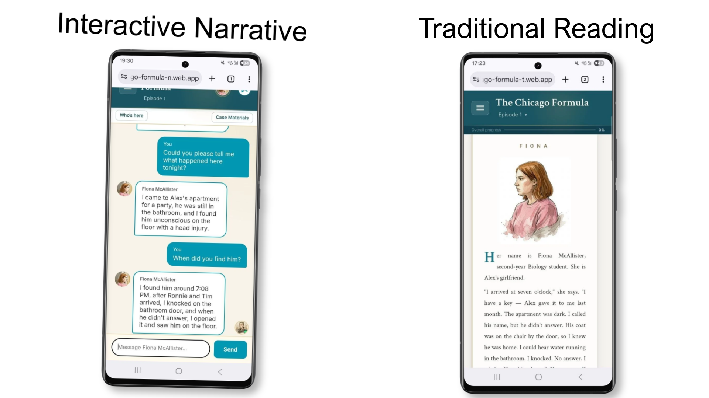

# Chicago Formula: LLM-powered Text Detective Game

Web application version of the Chicago Formula language learning game - an interactive detective mystery game for English language learners.

This game has been developed as a part of a PhD project and will be used in an experimental study.

## Production Firebase sites:
For the puprposes of the experiment, there are two versions of the game and a technical portal to gather data from participant participants and direct them between game versions.



### Interactive Narative version

*(solve the mystery by talking to AI characters)* 

📎 Link: https://chicago-formula-n.web.app/

🔑 Authentication: use code DEMO to try the game.

### Traditional version 
*(read the same mystery story, answer short questions related to the story)*

📎 Link: https://chicago-formula-t.web.app/

🔑 Authentication: use code DEMO to try the game.

### Portal
📎 Link: https://chicago-formula.web.app/

## Project Structure

```
web_teach_and_tell/
├── shared/                   # Source of truth for shared code
│   ├── backend/              # FastAPI backend (Cloud Run)
│   │   ├── main.py           # Application entrypoint
│   │   ├── auth.py           # Participant authentication
│   │   ├── ai_services.py    # Groq LLM integration
│   │   ├── game_handlers.py  # Tell game logic
│   │   ├── prompts/          # Character & tutor prompts
│   │   ├── game_texts/       # Scripted in-game messages
│   │   └── requirements.txt
│   └── frontend/             # Shared UI & API client (copied on deploy)
│       ├── css/
│       └── js/
│
├── Portal/                   # Study portal (login, consent, mode switch)
│   ├── frontend/
│   │   ├── portal.html       # Main portal app
│   │   ├── index.html        # Redirects to portal or placeholder
│   │   ├── css/
│   │   └── js/
│   ├── consent_forms/
│   └── questionnaire/
│
├── Tell/                     # Character-driven conversation app (frontend only)
│   └── frontend/
│       ├── index.html
│       ├── js/               # Tell-specific game UI
│       └── shared/           # Copy of shared/frontend (do not edit here)
│
├── Teach/                    # Detective reading course
│   ├── frontend/
│   │   ├── index.html
│   │   ├── js/               # Teach-specific reader & exercises
│   │   ├── data/             # stories/, exercises/, teach-manifest
│   │   └── shared/           # Copy of shared/frontend (do not edit here)
│   ├── week1_the_party.md    # Source markdown (also under frontend/data/)
│   └── week2_the_formula.md
│
├── Dockerfile                # Cloud Run image (builds from shared/backend)
├── dev-local.sh              # Local dev: API + all three frontends
└── deploy.sh                 # Deploy backend + Firebase frontends
```

**Shared assets:** edit `shared/frontend/` and `shared/backend/`. `Teach/frontend/shared/` and `Tell/frontend/shared/` are deployment copies; `dev-local.sh` and `deploy.sh` sync them from `shared/frontend/`.

## Features

- **Interactive Detective Game**: Solve a murder mystery while learning English
- **AI-Powered Characters**: Dynamic conversations with game characters using Groq LLM (Llama 3.3 70B)
- **Vocabulary Learning**: Built-in tutor for word explanations
- **Progress Tracking**: Learning progress and word tracking

## 🤖 AI Development Disclosure

**This project extensively used large language models (LLMs) during development**, including:
- Code generation and refactoring
- Documentation writing
- Bug fixing and debugging
- Architecture decisions

## Notes

The shorter game version is available as a Telegram bot (t.me/lingo_n_bot).